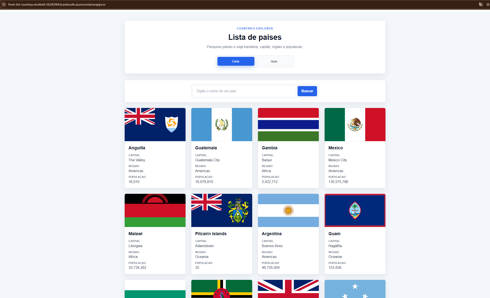

# Countries Explorer

Aplicacao Angular para listar paises consumindo uma API publica, com busca por nome, paginacao e um quiz de bandeiras.

## Preview



## Funcionalidades

- Listagem de paises
- Busca por nome
- Paginacao da lista
- Cards com bandeira, capital, regiao e populacao
- Modo quiz de bandeiras
- Validacao de resposta no quiz
- Interface responsiva
- Build em Docker com Nginx
- Deploy em Azure Container Apps

## Tecnologias

- Angular
- TypeScript
- HTML
- CSS
- REST Countries API
- Docker
- Nginx
- Docker Hub
- Azure Container Apps

## API utilizada

Os dados dos paises sao consumidos da API publica REST Countries:

```txt
https://restcountries.com/
```

## Executar localmente

Instale as dependencias:

```bash
npm install
```

Execute o servidor de desenvolvimento:

```bash
npm start
```

Acesse:

```txt
http://localhost:4200
```

## Build Angular

Para gerar os arquivos de producao:

```bash
npm run build
```

Os arquivos finais sao gerados em:

```txt
dist/front-list-countrys/browser
```

## Executar com Docker

Crie a imagem:

```bash
docker build -t front-list-countrys .
```

Execute o container:

```bash
docker run -d --name front-list-countrys -p 8080:80 front-list-countrys
```

Acesse:

```txt
http://localhost:8080
```

Para parar o container:

```bash
docker stop front-list-countrys
```

Para remover o container:

```bash
docker rm front-list-countrys
```

## Publicacao da imagem Docker

A imagem foi publicada no Docker Hub:

```txt
khallarrary/front-list-countrys:1.0
```

Comandos usados:

```bash
docker tag front-list-countrys khallarrary/front-list-countrys:1.0
docker push khallarrary/front-list-countrys:1.0
```

## Deploy

O projeto foi publicado no Azure Container Apps usando a imagem Docker hospedada no Docker Hub.

URL:

```txt
https://front-list-countrys.nicefield-56242f44.brazilsouth.azurecontainerapps.io/
```

Observação: por se tratar de um projeto de estudo hospedado em ambiente gratuito/educacional, a URL de deploy pode ficar temporariamente indisponível.

Configuracoes principais:

- Registry: Docker Hub
- Imagem: `khallarrary/front-list-countrys:1.0`
- Porta de destino: `80`
- Ingress: externo
- Runtime: Azure Container Apps

## Status

Projeto em desenvolvimento para estudo de Angular, consumo de API, componentizacao, Docker e deploy em cloud.
